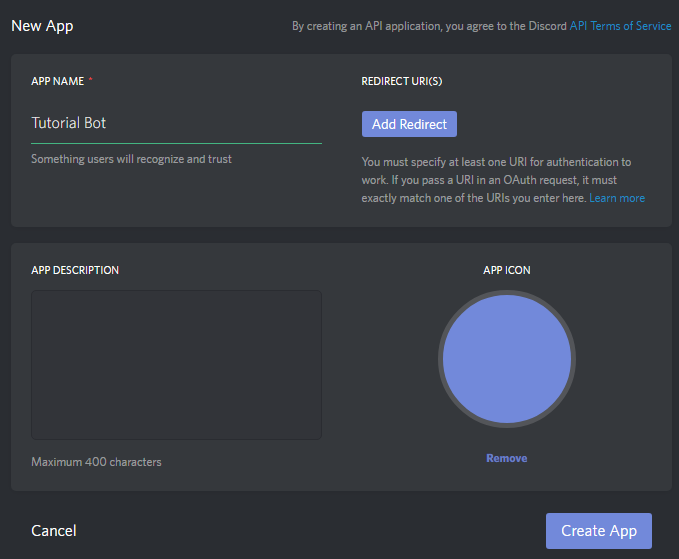
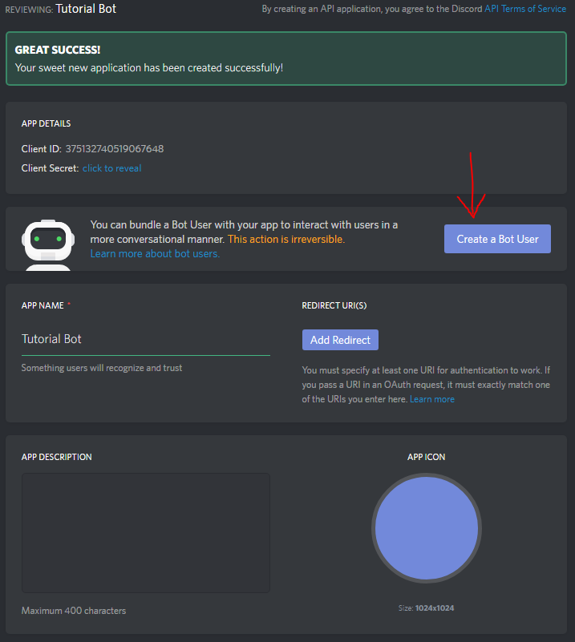
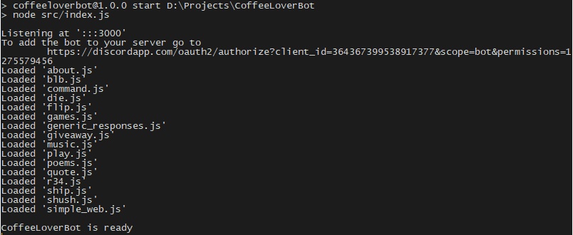
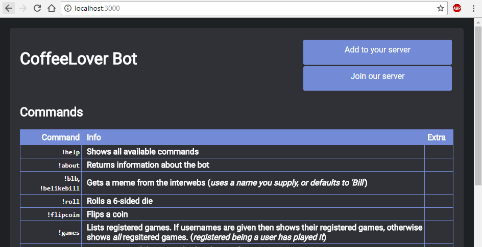

# CoffeeLover Bot
*The somewhat-sentient bot you'll never want to leave*

## Installation
Have the `git` cli and `nodejs`/`npm` installed

> If you want voice chat support you'll need [FFMPEG](http://ffmpeg.org/) binaries in your `PATH`

Some of the optional dependencies (*for voice support*) need to be built
```bash
# Windows (administrator powershell or cmd)
#	Installs python 2.7 and Visual Studio build tools
npm i -g --production windows-build-tools
cd path/to/CoffeeLoverBot
npm install # install all packages (best run as administrator when building node-opus)

# Linux (Debian-based for examples)
sudo apt-get install g++ autoconf automake libtool
cd path/to/CoffeeLoverBot
npm install # install all packages
```

```bash
# Clone the repo any way you want, we'll be using the git cli
git clone https://github.com/CoffeeLoverStudios/CoffeeLoverBot
cd CoffeeLoverBot
npm install
```

Go to your [Discord Apps](https://discordapp.com/developers/applications/me) and create a new one, giving it a name and filling out the details (*optional*); when you're ready click
`Create App`.



Select `Create a user bot`, and agree to the popup



Revealing the token, copy it and keep it for the next step

Create a new file in the `./CoffeeLoverBot/` directory called `.env` and insert
```
BOT_TOKEN=<Token from previous step, required>
CLEVERBOT_TOKEN=<Cleverbot token, optional>
```

> If you're on windows, you'll need to run a new
> Powershell, CMD or other shell **as administrator**
> and run `npm i -g --production windows-build-tools`

Now lead a shell to your `CoffeeLoverBot/` directory and
execute `npm start`. You've now started your bot!
If you don't get any errors, go to `http://localhost:<port>`, the port will be printed in the console once the bot is ready



As you'll notice towards the top of the image, this bot is listening at port *3000*,
so we'll be heading to `localhost:3000`



To add the bot to your server press the `Add to your server` button, or optionally
just copy and paste the link provided in the console.

The website also lists available commands and all the users on the server, along with
*important* information like their nickname, quotes and games

You can now freely edit `data/db.json` for responses and such, be sure to run `!refesh`
on your server so the bot refreshes all the commands

## Credit
*Created by CoffeeLover Studios 2017-2018*
Technologies used:
 - [Discord.js](https://discord.js.org/)
 - [Node.js](https://nodejs.org/)
 - [LowDB](https://github.com/typicode/lowdb)
 - [Cleverbot](https://www.cleverbot.com)
